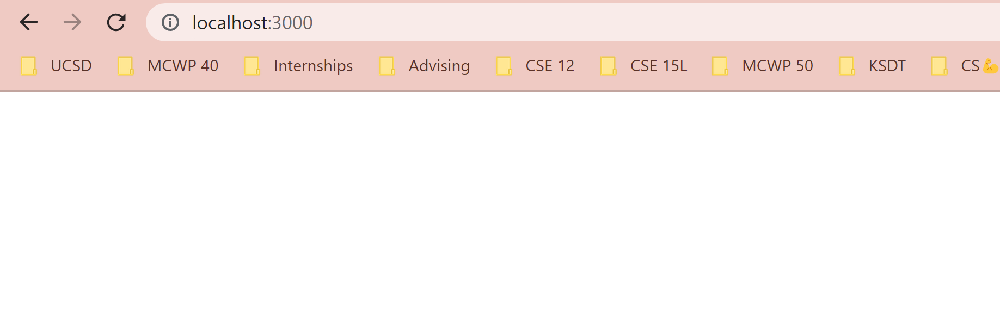
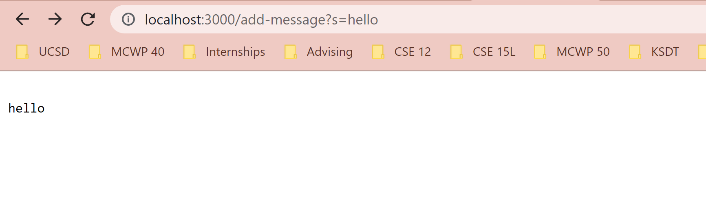
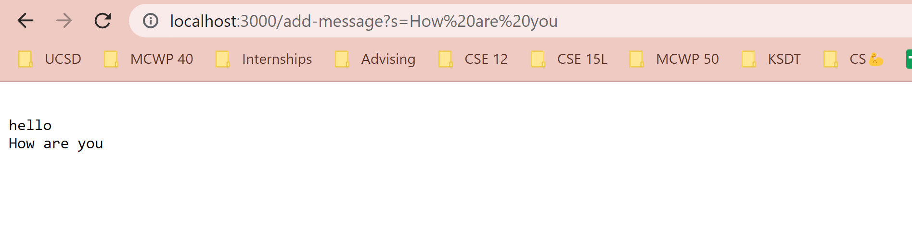

# Lab Report 2 - Servers and Bugs

## Part 1 - Create a Web Server

**Code for the Web Server - Server.java**
```
import java.io.IOException;
import java.io.OutputStream;
import java.net.InetSocketAddress;
import java.net.URI;

import com.sun.net.httpserver.HttpExchange;
import com.sun.net.httpserver.HttpHandler;
import com.sun.net.httpserver.HttpServer;

interface URLHandler {
    String handleRequest(URI url);
}

class ServerHttpHandler implements HttpHandler {
    URLHandler handler;
    ServerHttpHandler(URLHandler handler) {
      this.handler = handler;
    }
    public void handle(final HttpExchange exchange) throws IOException {
        // form return body after being handled by program
        try {
            String ret = handler.handleRequest(exchange.getRequestURI());
            // form the return string and write it on the browser
            exchange.sendResponseHeaders(200, ret.getBytes().length);
            OutputStream os = exchange.getResponseBody();
            os.write(ret.getBytes());
            os.close();
        } catch(Exception e) {
            String response = e.toString();
            exchange.sendResponseHeaders(500, response.getBytes().length);
            OutputStream os = exchange.getResponseBody();
            os.write(response.getBytes());
            os.close();
        }
    }
}
public class Server {
    public static void start(int port, URLHandler handler) throws IOException {
        HttpServer server = HttpServer.create(new InetSocketAddress(port), 0);

        //create request entrypoint
        server.createContext("/", new ServerHttpHandler(handler));

        //start the server
        server.start();
        System.out.println("Server Started! Visit http://localhost:" + port + " to visit.");
    }
}

```
**Code for the Web Server - StringServer.java**
```
import java.io.IOException;
import java.net.URI;

class Handler implements URLHandler {
    // The one bit of state on the server: a number that will be manipulated by
    // various requests.
    String message = "";

    public String handleRequest(URI url) {
        if (url.getPath().equals("/")) {
            return String.format(message);
        } else {
            System.out.println("Path: " + url.getPath());
            if (url.getPath().contains("/add-message")) {
                String[] parameters = url.getQuery().split("=");
                if (parameters[0].equals("s")) {
                    message += "\n" +parameters[1];
                    return String.format(message);
                }
            }
            return "404 Not Found!";
        }
    }
}

class StringServer {
    public static void main(String[] args) throws IOException {
        if(args.length == 0){
            System.out.println("Missing port number! Try any number between 1024 to 49151");
            return;
        }

        int port = Integer.parseInt(args[0]);

        Server.start(port, new Handler());
    }
}
```

**Web Server in Action**
To run this program compile using
`javac Server.java StringServer.java`

Then `java StringServer <any number between 1024 and 49151>`

Which returns a prompt in the terminal similar to this:
`Server Started! Visit http://localhost:3000 to visit.`

Every time the site is refreshed or a new command is added in the url the terminal returns the path `Path: /favicon.ico`for just a refresh and `Path: /add-message`when the command is used



Description: In this screenshot the web server is launched with just the link which runs the `handle()` and `start()` methods in the Server.java file. Since the url was created the if statement in the `main()` method did not run since 3000 is a valid integer port number but it does run the `start()` method following it. With the way I wrote this program the first if statement in the `handleRequest()` method does get run which returns the `message` however it is blank since the default variable `message` is set to an empty string.


Description: Once the server is up there is no need to run the methods to create the url again. When arguments are added to the url, for example in this case, `http://localhost:3000/add-message?s=hello` the program will run the `handleRequest()` method but instead of restarting from blank, if the proper query is added, the program will add the new string to the existing variable. The result of the this action is "hello" added on the next line of the blank line.


Description: Similarly to the previous screenshot this url and query runs the `handleRequest()` method which further adds onto the `message` variable. Once more it sends the new string to the next line while also displaying all the previous string values.

## Part 2 - Bugs

**Code from ArrayExamples.java before debug**
```
public class ArrayExamples {

  // Changes the input array to be in reversed order
  static void reverseInPlace(int[] arr) {
    for(int i = 0; i < arr.length; i += 1) {
      arr[i] = arr[arr.length - i - 1];
    }
  }

  // Returns a *new* array with all the elements of the input array in reversed
  // order
  static int[] reversed(int[] arr) {
    int[] newArray = new int[arr.length];
    for(int i = 0; i < arr.length; i += 1) {
      arr[i] = newArray[arr.length - i - 1];
    }
    return arr;
  }

  // Averages the numbers in the array (takes the mean), but leaves out the
  // lowest number when calculating. Returns 0 if there are no elements or just
  // 1 element in the array
  static double averageWithoutLowest(double[] arr) {
    if(arr.length < 2) { return 0.0; }
    double lowest = arr[0];
    for(double num: arr) {
      if(num < lowest) { lowest = num; }
    }
    double sum = 0;
    for(double num: arr) {
      if(num != lowest) { sum += num; }
    }
    return sum / (arr.length - 1);
  }
}

```
**Inputs - Test Cases**
```
import static org.junit.Assert.*;
import org.junit.*;

public class ArrayTests {
	@Test 
	public void testReverseInPlace() {
    int[] input1 = { 3 };
    ArrayExamples.reverseInPlace(input1);
    assertArrayEquals(new int[]{ 3 }, input1);
	}

  @Test 
	public void testReverseInPlace2() {
    int[] input2 = {4,5,6};
    ArrayExamples.reverseInPlace(input2);
    assertArrayEquals(new int[]{6,5,4}, input2);
	}

  @Test
  public void testReversed() {
    int[] input1 = { };
    assertArrayEquals(new int[]{ }, ArrayExamples.reversed(input1));
  }

  @Test
  public void testReversed2() {
    int[] input2 = {1,2,3};
    assertArrayEquals(new int[]{3,2,1}, ArrayExamples.reversed(input2));
  }
}
```
**Symptoms** 

The two test cases that passed were `testReverseInPlace()` and `testReversed()` because they did not trigger the bug which is related to the indices or reassignment. Since there is only one element, no matter, how the element is arranged it would still remain in the same place and return the desired result. On the other end, `testReverseInPlace2()` and `testReversed2()` failed because it displays the bugs now that there are more than one element.

**Bugs**
From the test cases and looking at the code I noticed that with the `reverseInPlace()` method the elements were not being assigned properly. The last element, for example, would get assigned to the index of the first element but the first element would not get assigned to the index of the last element. Even if the contents inside the loops were working properly they method would still not work properly because the for loop runs twice the amount of times it needs which would reverse the effects. For the `reversed()` method the values of the returned array become zero because the program in returning the original array reassigned with the values of the new array which are all zero instead of return the new array reassigned with values from the orignal array.

To fix these issues, the `reverseInPlace()` loop is reduced to running for half the amount of times and values are reassigned on both ends of the array. for the `reversed()` method the `arr` and `newArray` values inside of the for loops are exchanged and the end of the loop returns the `newArray` instead of the original array `arr`. 

**Code from ArrayExamples.java after debug**
```
public class ArrayExamples {

  // Changes the input array to be in reversed order
  static void reverseInPlace(int[] arr) {
    for(int i = 0; i < arr.length/2; i += 1) {
      int original = arr[i];
      arr[i] = arr[arr.length - i - 1];
      arr[arr.length - i - 1]=original;
    }
  }

  // Returns a *new* array with all the elements of the input array in reversed
  // order
  static int[] reversed(int[] arr) {
    int[] newArray = new int[arr.length];
    for(int i = 0; i < arr.length; i += 1) {
      newArray[i] = arr[arr.length - i - 1];
    }
    return newArray;
  }

  // Averages the numbers in the array (takes the mean), but leaves out the
  // lowest number when calculating. Returns 0 if there are no elements or just
  // 1 element in the array
  static double averageWithoutLowest(double[] arr) {
    if(arr.length < 2) { return 0.0; }
    double lowest = arr[0];
    for(double num: arr) {
      if(num < lowest) { lowest = num; }
    }
    double sum = 0;
    for(double num: arr) {
      if(num != lowest) { sum += num; }
    }
    return sum / (arr.length - 1);
  }
}
```
## Part 3 - Learnings
The most useful thing that I learned from week 3 is the process for dealing with bugs by breaking them down into bugs, a flaw in the system, symptoms, the behavior of the program, and using failure inducing inputs which can be in the form of testers. Normally when I run into an issue with my code I tend to use a brute force method where I try changing code in different places randomly which often ends with a lot of frustration. The concept of breaking down the error seems like common sense, however, it is a process that I never formally utilized before and I am glad to know now.
