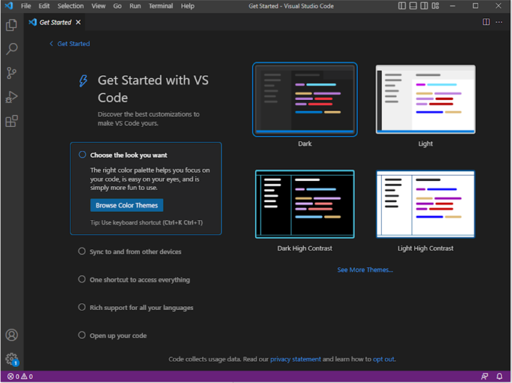
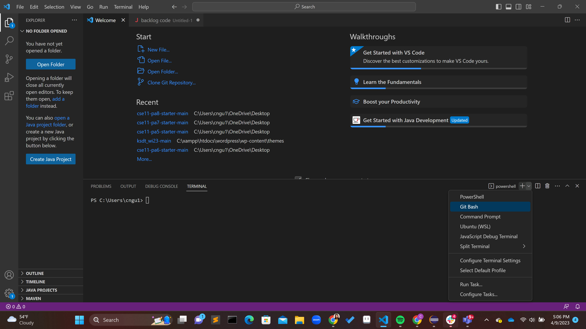

# Lab Report 1 - Remote Access and FileSystem - How to log into course specific account

## Step 1 - Access VS Code
Open to install vs code on your device. Depending on your device the layout may vary.



## Step 2 - Connect to Remote Server

If you are on Windows install git for [Windows](https://gitforwindows.org/).

After you have installed git on to your device you will need to access the git bash terminal on VSCode. To do this **Ctrl + `** to open the terminal, locate the **+** next to the powershell button, click on the down turned arrow, and select **Git Bash**.



Once the Bash terminal is open you may now use ssh. In the terminal type in ssh followed by your course specific account user. For example:

```
$ ssh cs15lsp23ko@ieng6.ucsd.edu
```
If it is the first time you are logging on you might encounter this prompt:
```
⤇ ssh cs15lsp23ko@ieng6.ucsd.edu
The authenticity of host 'ieng6.ucsd.edu (128.54.70.227)' can't be established.
RSA key fingerprint is SHA256:ksruYwhnYH+sySHnHAtLUHngrPEyZTDl/1x99wUQcec.
Are you sure you want to continue connecting (yes/no/[fingerprint])? 
```
Type in **yes**. The prompt will then ask you to enter your password, enter your password.
```
⤇ ssh cs15lsp23ko@ieng6.ucsd.edu
The authenticity of host 'ieng6-202.ucsd.edu (128.54.70.227)' can't be established.
RSA key fingerprint is SHA256:ksruYwhnYH+sySHnHAtLUHngrPEyZTDl/1x99wUQcec.
Are you sure you want to continue connecting (yes/no/[fingerprint])? 
Password: 
```
We have some issues with ITS so after loggining in you may encounter this prompt:
```
Connection closed by 128.54.70.238 port 22
```
If you are encountering this issue, try signing into your personal UCSD account followed by @ieng6.ucsd.edu:
```
⤇ ssh chn029@ieng6.ucsd.edu
```
You will then see a prompt similar to this:
```
Last login: Thu Apr  6 14:30:58 2023 from its-cseb260-20.ucsd.edu

You are using 0% CPU on this system

Cluster Status 
Hostname     Time    #Users  Load  Averages  
ieng6-201   17:35:01   12  1.05,  1.12,  1.20
ieng6-202   17:35:01   7   4.23,  4.20,  4.26
ieng6-203   17:35:01   16  1.51,  1.50,  1.49
```
## Step 3 - Run Commands
Once you are longged in you are ready to run some commands. 
